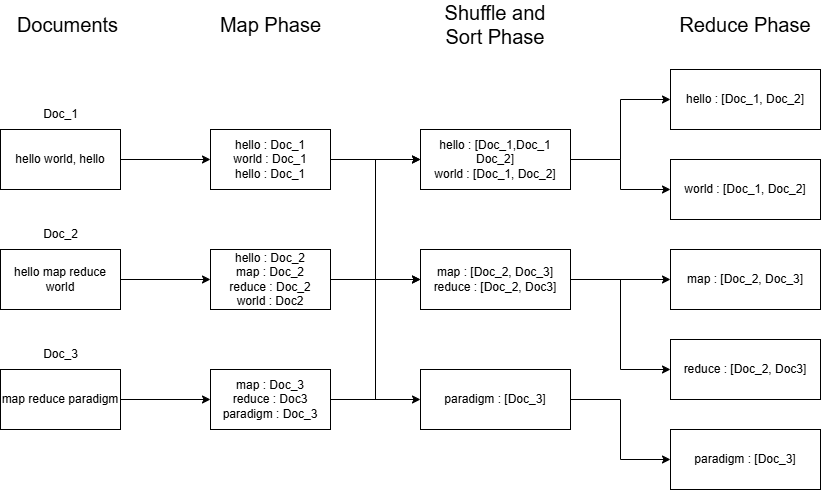
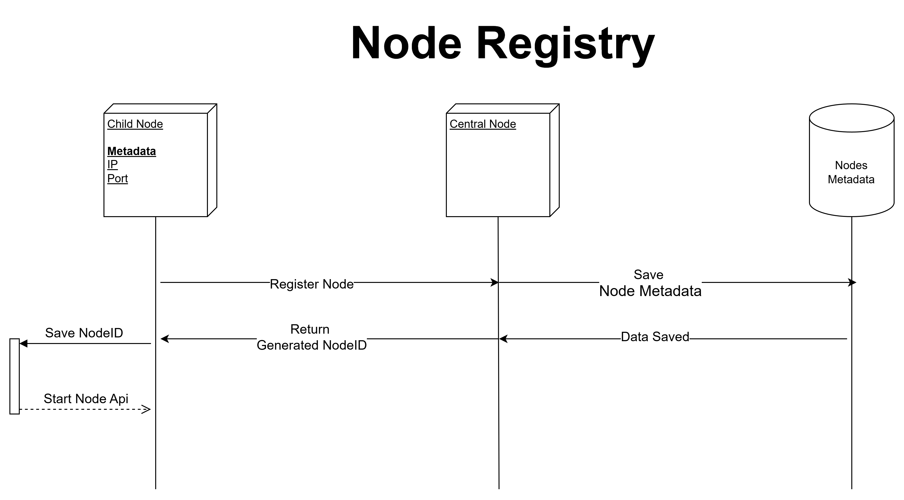

# **Distributed MapReduce Framework**

This project **Distributed MapReduce Framework** is designed for handling data-intensive computational tasks. The framework distributes work across multiple nodes using Flask for communication, ensuring efficient execution of mapping, shuffling, sorting, and reduction operations.

---

## **Project Overview**

The **MapReduce Framework** splits a large task into smaller, concurrent sub-tasks, enabling parallel execution across a network of nodes. The central node acts as the orchestrator, while child nodes execute core operations such as mapping and reducing.



### **Key Benefits**
- **Scalability**: Handles large datasets by distributing tasks across multiple nodes.
- **Efficiency**: Parallel processing accelerates task completion.
- **Fault Tolerance**: Ensures resilience in case of file upload failures.

---

## **System Architecture**

The architecture is composed of a **central node** that coordinates the process and **child nodes** that perform the computational tasks. Nodes dynamically register with the central node, enabling a scalable and flexible system.



### **Components**
1. **Central Node**:
   - Registers and manages connected nodes.
   - Distributes files and triggers task execution.
   - Monitors status and aggregates final results.
2. **Child Nodes**:
   - Accept files and process them using the MapReduce workflow.
   - Communicate with other nodes to shuffle and sort data.
   - Perform reduction to produce final outputs.

---

## **Workflow**

1. **Node Registration**:
   - Child nodes register with the central node via an API.
   - Metadata (e.g., IP address, port) is maintained in a registry.
2. **File Distribution**:
   - Input files are split and distributed to child nodes for processing.
3. **Mapping**:
   - Each node processes its files using a mapper function to produce intermediate key-value pairs.
4. **Shuffling and Sorting**:
   - Intermediate results are exchanged among nodes to group data by keys.
5. **Reduction**:
   - Grouped data is reduced using a reducer function to aggregate the results.

---

## **Key Functionalities**

### **Central Node**
The central node coordinates the system by:
1. **Node Registration**:
   - Manages active nodes with unique IDs, IP addresses, and ports.
   - Ensures dynamic scalability.
2. **File Distribution**:
   - Evenly distributes input files to child nodes for processing.
3. **Task Coordination**:
   - Initiates and monitors the MapReduce workflow.

### **Child Nodes**
Child nodes perform the computational tasks by:
1. **Mapping**:
   - Generates key-value pairs from assigned input files.
2. **Shuffling and Sorting**:
   - Groups intermediate key-value pairs by key.
   - Exchanges data with other nodes to ensure proper grouping.
3. **Reduction**:
   - Aggregates grouped data to produce final results.

---

## **Setup and Usage**

### **Prerequisites**
1. Python 3.x
2. Flask
3. `requests` library

### **Steps to Run**
1. **Start the Central Node**:
   ```bash
   python centralnode.py
   ```
   The central node starts on port `5000`.

2. **Start Child Nodes**:
   Run `node.py` on different systems or processes:
   ```bash
   python node.py
   ```

3. **Upload Files**:
   Place input files in the `documents/` folder.

4. **Start MapReduce**:
   Use the central node's API to initiate the MapReduce process:
   ```bash
   curl -X POST http://<central_node_ip>:5000/api/centralNode/mapReduce
   ```

---

## **Contributors**
- **Thakur Jaideep Singh** - Project Lead and Developer
```